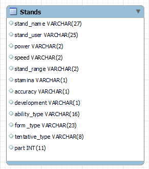

# Winforms DB - test


## Zadání A2

- Načtěte od uživatele číslo z rozmezí 3 až 8.  
- Vytvořte třídu `Stand`, která bude reprezentovat tabulku z databáze a bude uchovávat:
  - Name -> stand_name
  - User -> stand_user
  - Power -> power
  - Speed -> speed
  - Part -> part
- Třída bude mít metodu `getStandsByPart(char part)` která vrátí `List<Stand>`
- Zobrazte uživateli **všechny** záznamy, jejichž hodnota ve sloupečku `Speed` je `A`, nebo `B` a zároveň hodnota ve sloupečku `Strength` je `C`

### DB údaje

```cs

// Connection string
var builder = new MySqlConnectionStringBuilder
            {
                Server = "db.horvathdb.online",
                UserID = "student",
                Password = string.Empty,
                Database = "Tests",
            };
```  

### Schema

